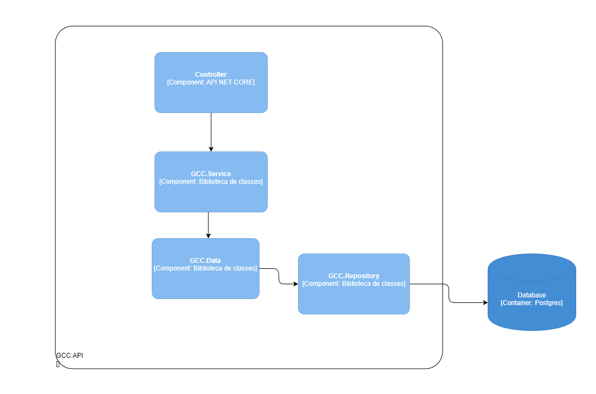

## Diagrama de componentes

O diagrama a seguir, ilustra os componentes da aplicação.

Sendo assim, os componentes são divididos da seguinte forma:

* **Controller** - esse componente é responsável por intermediar as requisições externas (Interface) ou componentes, processando as informações e repassando para a camada seguinte.

* **Service** - esse componente é responsável pela lógica de negócio e manipulação dos dados.

* **Data** - esse componente é responsável pela estruturação do banco de dados em forma de modelo e classes de negócio.

* **Repository** - esse componente é responsável pela manipulação referente às entidades dentro do banco de dados.

