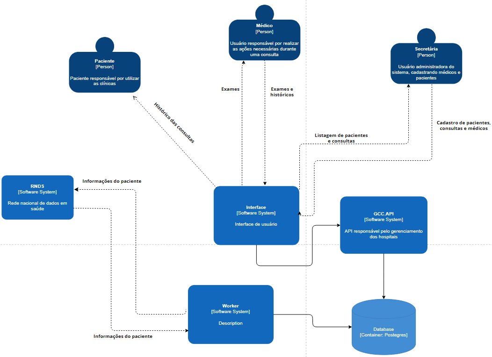

## Diagrama de conteires

O diagrama a seguir, ilustra os conteires da aplicação.

As interfaces de usuário, sejam elas destinadas aos Pacientes, Médicos, ou Secretárias, necessitam buscar e retornas informações. 

Para tanto, a interface se comunica com a API, fazendo as requisições. A API por sua vez, busca essas informações no Banco de dados (Database).

O Banco de dados podem ser alimentados pelo RNDS (Rede Nacional de Dados em Saúde), e por se tratar de dados sensíveis, existe um Worker que contratola esse fluxo.