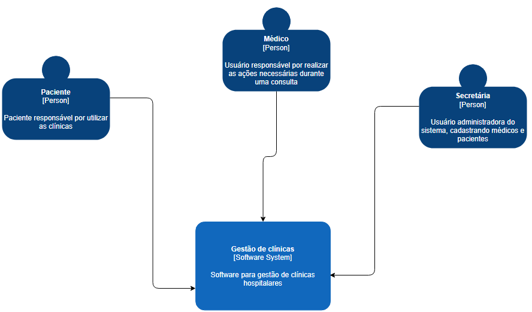

## Diagrama de contexto
---

O diagrama de contexto tem por objetivo mostrar como entidades externas interagem com o sistema, ou seja, colaborando em conjunto com os analistas de negócios e partes interessadas a obter uma visão geral do escopo do sistema.
Nosso escopo de negócio está relacionada a área da saúde, abordando o levantamento e especificações de requisitos, produzindo o design do software referente ao sistema de gestão hospitalar (GCC).
O diagrama a seguir ilustra o contexto de nossa aplicação:

 

  

Através do diagrama é possível visualizar três atores principais, com suas respectivas responsabilidades
* Paciente: este tem por objetivo agendar uma consulta por exemplo para atender suas necessidades.
* Médico: responsável por dar andamento as questões hospitalares, como atendimento de pacientes, solicitação de exames, etc.
* Secretária: esta terá o papel de gerenciar o ambiente, desde os agendamentos de consultas, cadastro de pacientes, até o momento da realização das consultas.