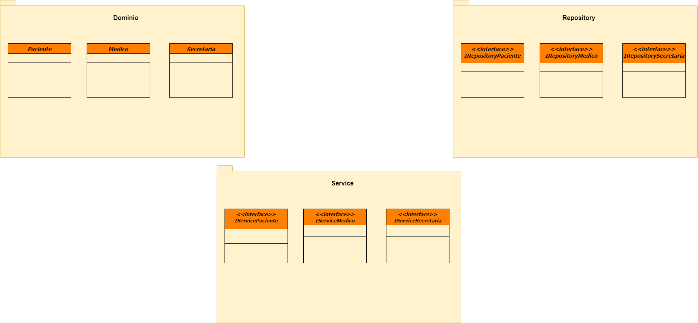
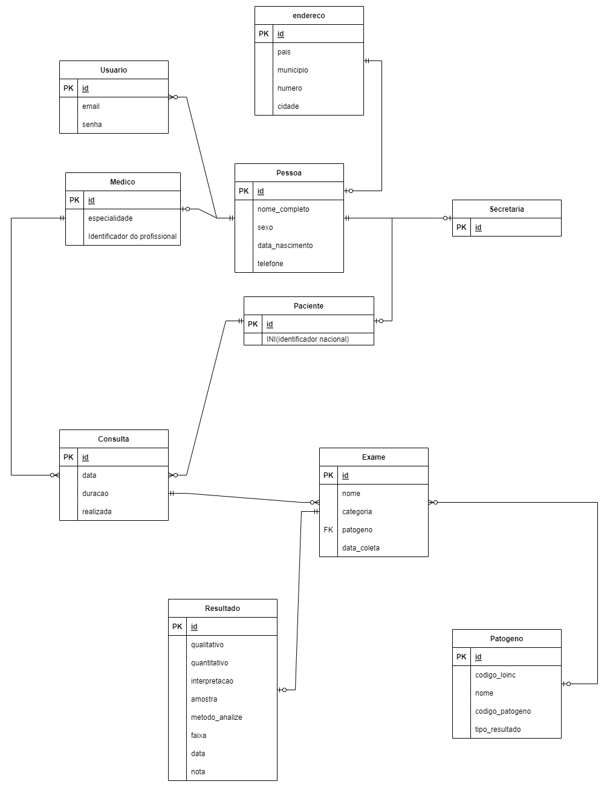

## Design
---

O software de gestão hospitalar (GCC) teve seus artefatos produzidos utilizando o modelo C4, no qual foi desenvolvido os diagramas de contexto, container e componentes.
Para os diagramas de classes e o MER, utilizou-se da ferramente draw.io

Através do diagrama de contexto foi estabelicido os objetivos do sistema, explicitando seus possíveis atores com suas responsabilidades e ações dentro do sistema.

Após a definição destes atores e do propósito do sistema, foi possível aprofundar nos detalhes arquiteturais desenvolvendo o diagrama de contêiner, no qual é apresentado as responsabilidades de cada um.Com isso um próximo nível foi estabelecido apresentando a visualização do diagrama de componetes relacionadas ao GCC, esse com o objetivo de organizar a arquitetura do sistema, suas camadas e o objetivo de cada uma.

Através do diagrama de classe, temos a separação das responsabilidades e dos serviços em cada camada apresentada no diagrama de componentes, visualizando como as mesmas devem se comunicar e interagir ao longo do processo.

 

 

O MER é utilizado para descrever os objetos do mundo real através de entidades, com suas propriedades que são os atributos e os seus relacionamento, visualizando a interação que cada entidade terá umas com as outras.

